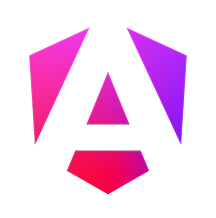

  

Hi , I'm Eugen Birich, 👋  
an IHK-certified frontend developer (German Chamber of Commerce and Industry) with in-depth knowledge of JavaScript, TypeScript, and Angular.

During my advanced training at the <a href="https://developerakademie.com/" target="_blank" rel="noreferrer" style="text-decoration: none;"> Developer Akademie GmbH</a>, I was able to deepen my structured development skills through numerous practical projects, consistently prioritizing user needs and working effectively and agilely in a team.

I'm always open to new learning opportunities – currently, I'm expanding my Python knowledge to further develop my backend skills.

I'm eager to participate in exciting projects and explore new networking opportunities.

<h1 align="left">Languages and Tools:</h1>
<h3>Frontend</h3>

     

<h3>Dev-Tools</h3>

 

<h1 align="left">Contact:</h1>

 or <a href="mailto:info@birich.it">info@birich.it</a>
